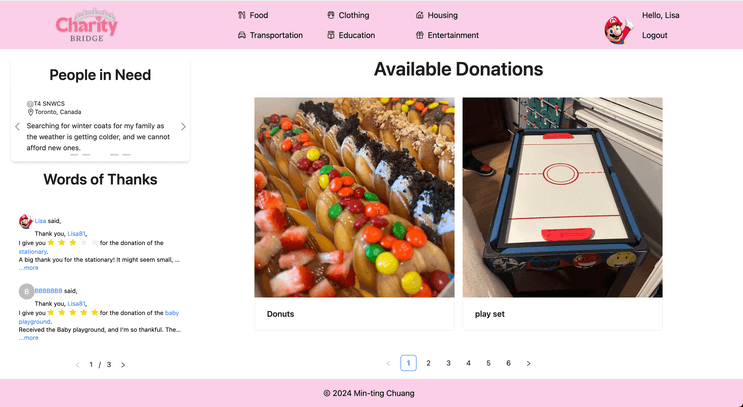

# Charity Bridge

**Deployed Site**: [Charity Bridge](https://main--charitybridge.netlify.app/)

**Backend Platform**: Appwrite

**Frontend Framework**: React.js

**UI Libraries**: Tailwind CSS, Ant Design

## Project Overview

**Charity Bridge** is a platform that enables users to post donation items, browse others' contributions, and communicate with one another via an internal messaging system. The platform emphasizes seamless user experience, responsive design, and efficient data management.

## Project Goals

- Provide a user-friendly platform for sharing and receiving donations, and giving thanks to donors.
- Facilitate user interactions through secure and intuitive messaging features.
- Enable efficient management of donation items using modern web technologies.

## Features

- Oauth 2.0 Authentication: Secure and easy login using third-party services.
- Data Management (CRUD): Users can create, read, update, and delete donation entries.
- File Uploading: Upload images for donation items.
- Dynamic Item Rendering: Display items based on categories and filters.
- Pagination: Optimized rendering of items for improved performance and user experience.
- Responsive Design: Fully optimized for various screen sizes and devices.
- Error Handling: Robust error messages and fallback mechanisms to ensure smooth operation.

## Technology Stack

- Frontend: React.js for building interactive user interfaces.
- Backend: Appwrite for managing authentication, database, and file storage.
- UI Design: Tailwind CSS and Ant Design for modern, visually appealing, and responsive components.
